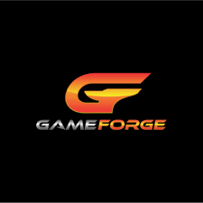
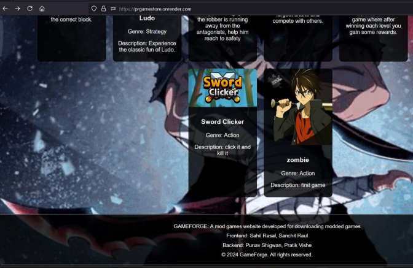
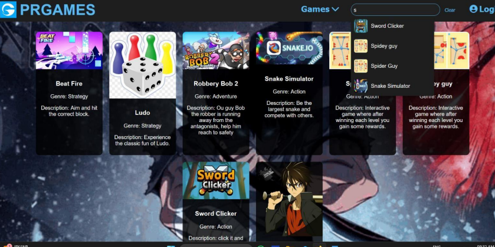
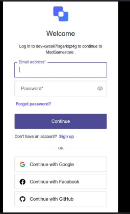
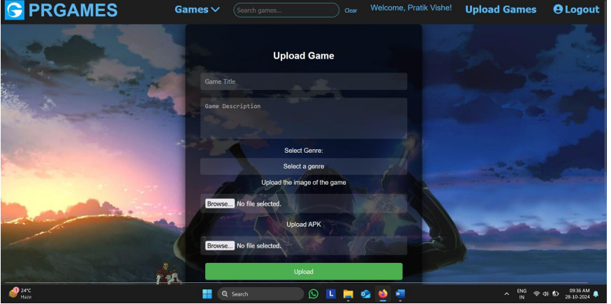

# 🎮 PrGAmeStore: The MERN Web Game Store

> **A community-driven, open-source platform to share, discover, and trade pirated & forge games — like Wikipedia, but for games!**

<p align="center">
  
</p>

<p align="center">
  <a href="https://prgamestore.onrender.com"></a>
  <a href="https://github.com/PunavShigwan/PRGamestore"></a>
  <a href="https://github.com/PunavShigwan/gamestoreBackend"></a>
</p>

---

## ✨ What is PrGAmeStore?

PrGAmeStore is a MERN stack-based web game store for pirated and forge games. Think of it as the Wikipedia for games: you can give games, take games, and contribute to a growing library of community-driven content.

---

## 🚀 Live Demo

👉 [**View the Deployed App**](https://prgamestore.onrender.com)

---

## 🛠️ Tech Stack

- ⚛️ **Frontend:** React.js
- 🟩 **Backend:** Node.js, Express.js
- 🍃 **Database:** MongoDB
- 🔑 **Authentication:** JWT & Context API

---

## 🌟 Features

|  | Feature | Description |
|:-:|:--------|:------------|
| 🕹️ | **Game Library** | Browse, search, and discover pirated and forge games |
| 📥 | **Upload & Share** | Add your own games for others to download |
| 🔄 | **Give & Take** | Download games from the community and contribute your own |
| 📝 | **Wiki-Style Info** | Each game has detailed, editable information — just like Wikipedia! |
| 🔒 | **Authentication** | Secure login and registration for all users |
| 🎨 | **Modern UI** | Clean, responsive, and user-friendly interface |

---

## 📸 Preview

<p align="center">
  
</p>

---

## 🖼️ Screenshots

### 🦶 Footer


### 🔍 Search Feature


### 🔐 Login using Auth0


### ⬆️ Upload Your Own Game


---

## 🧑‍💻 Getting Started

```bash
# 1. Clone the repository
$ git clone https://github.com/PunavShigwan/PRGamestore

# 2. Install dependencies
$ cd PRGamestore
$ npm install

# 3. Start the frontend
$ npm start
```

- **Start the backend:**
  See [Gamestor Backend](https://github.com/PunavShigwan/gamestoreBackend)

---

## 📂 Project Structure

```
PRGamestore/
├── public/         # Static assets and images
├── src/            # React frontend code
└── backend/        # Node.js/Express backend (see backend repo)
```

---

## 🤝 Contributing

> **We 💖 contributions!**
>
> - Fork the repo
> - Create a new branch
> - Make your changes
> - Open a pull request
>
> _All ideas, bug fixes, and improvements are welcome!_

---

## 📜 License

> This project is for educational purposes only. All game content is user-submitted and for personal use.

---

## 🔗 Links

- [Frontend Repository](https://github.com/PunavShigwan/PRGamestore)
- [Backend Repository](https://github.com/PunavShigwan/gamestoreBackend)
- [Live Demo](https://prgamestore.onrender.com)
