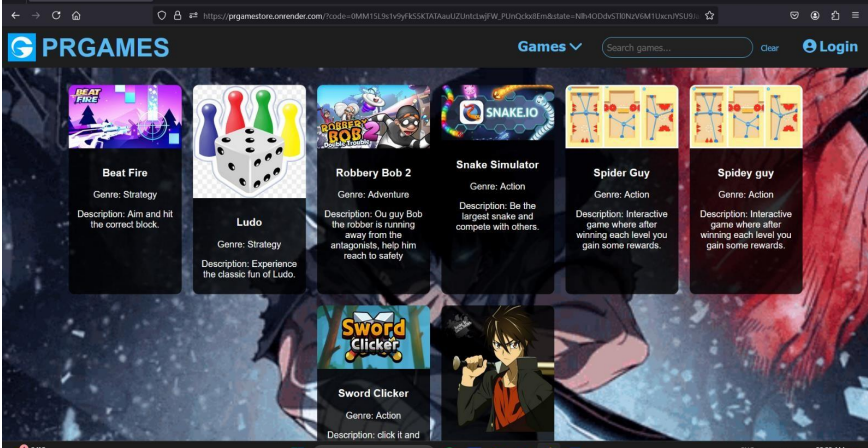

# 🎮 PrGAmeStore: The MERN Web Game Store


Welcome to **Gamestor** — a MERN stack-based web game store for pirated and forge games! Think of it as the Wikipedia for games: you can give games, take games, and contribute to a growing library of community-driven content.

---

## 🚀 Live Demo

> [View the Deployed App](https://prgamestore.onrender.com) <!-- Replace with your actual deployed URL -->

---

## 🛠️ Tech Stack

- **Frontend:** React.js
- **Backend:** Node.js, Express.js
- **Database:** MongoDB
- **Authentication:** JWT & Context API

---

## 🌟 Features

- 🕹️ **Game Library:** Browse, search, and discover pirated and forge games.
- 📥 **Upload & Share:** Add your own games for others to download.
- 🔄 **Give & Take:** Download games from the community and contribute your own.
- 📝 **Wiki-Style Info:** Each game has detailed, editable information — just like Wikipedia!
- 🔒 **Authentication:** Secure login and registration for all users.
- 🎨 **Modern UI:** Clean, responsive, and user-friendly interface.

---

## 📸 Preview



---

## 🧑‍💻 Getting Started

1. **Clone the repository:**
   ```bash
   git clone https://github.com/PunavShigwan/PRGamestore
   ```
2. **Install dependencies:**
   ```bash
   cd PRGamestore
   npm install
   ```
3. **Start the frontend:**
   ```bash
   npm start
   ```
4. **Start the backend:**
   See [Gamestor Backend](https://github.com/PunavShigwan/gamestoreBackend) <!-- Replace with your backend link -->

---

## 📂 Project Structure

- `/public` — Static assets and images
- `/src` — React frontend code
- `/backend` — Node.js/Express backend (see backend repo)

---

## 🤝 Contributing

Contributions are welcome! Feel free to fork the repo, open issues, or submit pull requests.

---

## 📜 License

This project is for educational purposes only. All game content is user-submitted and for personal use.

---

## 🔗 Links

- [Frontend Repository](https://github.com/PunavShigwan/PRGamestore)
- [Backend Repository](https://github.com/PunavShigwan/gamestoreBackend)
